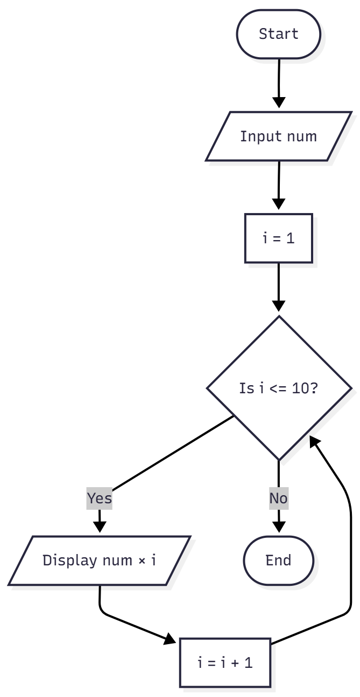
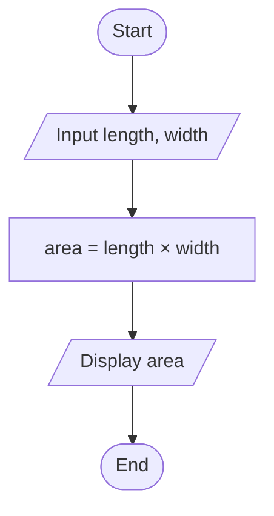

# 1. Check Even or Odd number

I wrote the pseudo code of this programm and drew the flowchart.

## PSEUDOCODE

- START
- INPUT number
- IF number % 2 == 0 THEN
- PRINT Even
- ELSE
- PRINT Odd
- ENDIF
- END

## FLOWCHART

# 2. Calculate Total and Avg

## PSEUDOCODE

* START
* INPUT mark1, mark2, mark3
* total = mark1 + mark2 + mark3
* average = total / 3
* DISPLAY total, average
* END

## FLOWCHART

# 3. Multiplication of numbers

## PSEUDOCODE

* START
* INPUT num
* FOR i = 1 TO 10
* PRINT num × i
* END FOR
* END

## FLOWCHART

# 4. Poistive, Negative and Zero

## PSEUDOCODE

* START
* INPUT num
* IF num > 0 THEN
* DISPLAY "Positive"
* ELSE IF num < 0 THEN
* DISPLAY "Negative"
* ELSE
* DISPLAY "Zero"
* END IF
* END

## FLOWCHART

# 5. Simple Interest Calculator

## PSEUDOCODE

* START
* INPUT P, R, T
* SI = (P × R × T) / 100
* DISPLAY SI
* END

## FLOWCHART

 # 6. Average Temperature Calculation

 ## PSEUDOCODE

* START
* sum = 0
* FOR i = 1 to 7
* INPUT temp
* sum = sum + temp
* END FOR
* average = sum / 7
* DISPLAY average
* END

## PSEUDOCODE

# 7. Calculate Area of Rectangle

## PSEUDOCODE

* START
* INPUT length, width
* area = length × width
* DISPLAY area
* END

## FLOWCHART

